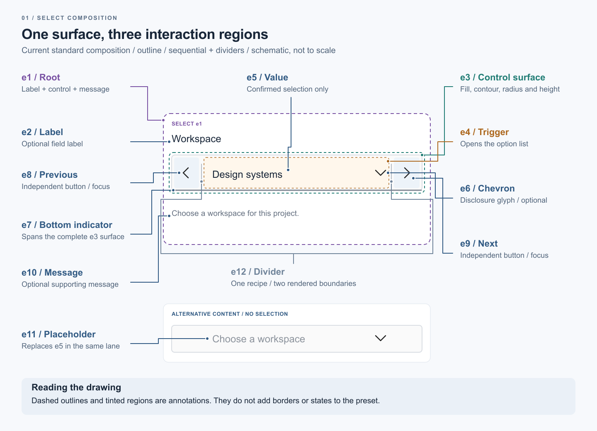
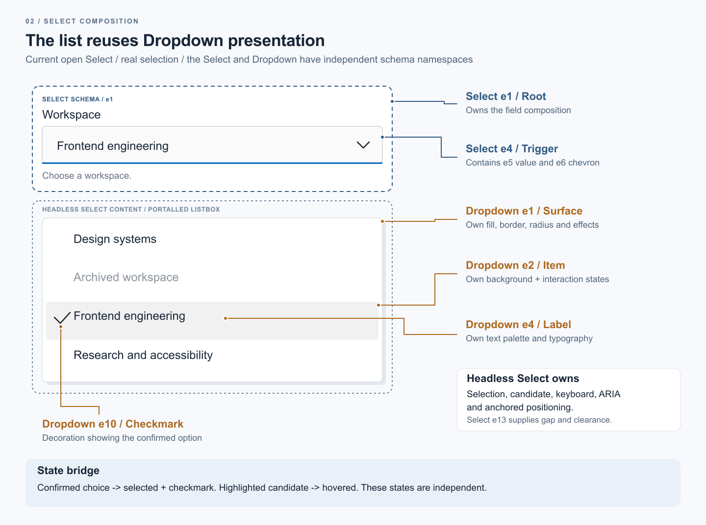

# Select presentation

Import `Select` and `SelectProps` from `@kiskadee/react-components/select`.
The component accepts Headless selection/open props plus `label`, `message`, `mode`, `size`,
`radius`, `surfaceContext` and `sequential`. `previousLabel`/`nextLabel` localize the sequential
controls. Options accept React labels and optional `textValue` for textual navigation.

## Visual anatomy

These diagrams explain the current Web composition. They are schematic illustrations, not pixel
specifications or screenshots of a preset. Colored boundaries, tinted regions and leader lines are
annotations; they do not introduce additional borders, interaction states or Schema elements.

### Control and sequential regions

[Scalable SVG source](select/select-control-anatomy.svg).

The root e1 contains the label, common control surface and supporting message. e3 owns the surface
shared by the three interactive regions; e4 opens the list, while e8/e9 confirm adjacent values.
The bottom indicator e7 spans e3 even though only trigger focus can activate its focus presentation.
e12 is one Schema recipe rendered twice when sequential dividers are enabled. e11 replaces e5
when no value is selected; they are alternative contents of the same trigger lane.

Internal wrappers x1 and x2 are omitted from this overview: they organize the interactive lane and
clip bottom paint, respectively. They are structural helpers, not additional Schema elements.

### Open list and independent Dropdown presentation

[Scalable SVG source](select/select-open-dropdown.svg).

The element IDs are scoped to their components: Select e1 and Dropdown e1 are different elements,
as are Select e4 (trigger) and Dropdown e4 (option label). The list composes Dropdown.Surface (e1),
Dropdown.Item (e2), Dropdown.Label (e4) and Dropdown.Checkmark (e10). Dropdown.Items and Dropdown.Group
organize these slots without creating additional Select elements.

Headless Select.Content supplies the portalled listbox and anchored positioning. Select e13 supplies
its anchor gap and collision clearances through generated scale tokens.
Headless retains selection, candidate, keyboard and ARIA semantics. p-react maps confirmed selection
to Dropdown Selected and checkmark visibility, and highlighted candidates to Hover independently.
The illustrated neutral selected fill does not prescribe a color for all presets.

### Reading the attributes

Keep three questions separate: what the Schema accepts, what the Web composition consumes, and
what a particular preset actually authors. The [Core slot-specific style grammar](../../../../core/docs/definitions/select.md#slot-specific-style-grammar)
lists the supported fields for each element; e1-e11 no longer share a generic attribute bag.

The common surface e3 owns nominal height. Trigger and lateral controls stretch inside it rather
than consuming individual height tokens. Direct generated CSS applies their authored padding,
radius and typography; these do not require a custom-property read in structural Sass.
e12 references a separator profile for thickness/color and accepts only a local `boxHeight` scale.
For concrete authorship, inspect the
[Fluent recipe](../../../../presets/src/presets/fluent-2-microsoft/components/select.schema.ts)
or [Sandbox recipe](../../../../presets/src/presets/sandbox/components/select.schema.ts).

## Presentation and resource ownership

Schema slot ownership is specified in the [Core contract](../../../../core/docs/definitions/select.md).
All three modes share the standard structural composition. The trigger is the interaction
activator for its value and chevron. Sequential buttons each own native interaction and focus.
The root projects only global disabled presentation. Real selection is consumed through
`useSelectState()` and projected as Selected on the control and trigger; suggestions do not
activate it. Dropdown maps Headless `highlighted` to Hover independently of Selected.
The step render state projects each endpoint's own Disabled class without recomputing destinations
or disabling the shared shell. Native disabled semantics and step event behavior remain Headless.

Resource loading keeps the Headless root mounted. Missing recipes render no structural or recipe
classes; supplied consumer classes remain supported. Raw lists do not instantiate Dropdown.
When Select is styled but Dropdown is absent, the list remains headless. Load errors are surfaced
with retry instead of being interpreted as absence.

The outer control e3 owns the common surface, contour, radius and minimum height. The x1 lane
contains trigger e4 and optional Previous/Next e8/e9. The x2 paint layer clips e7 at the outer
border edge, across all three lanes, without clipping the control's external keyboard indicators.
Only actual trigger focus projects Focus on this paint host. Laterals keep separate native rings.
Missing e7 is supported without synthesizing a recipe. No preset name is consulted.

`focusIndicator` accepts `underline`, `inner`, or `outer`. `focusRingColorSource` accepts `global`
or `component`. Each resolves explicit prop, mode artifact option, component artifact option, then
general default (`underline` and `global`). Underline uses e7 on trigger focus. Inner reuses e4's
contour on highlighted focus, increasing only thickness beyond the existing native border.
Outer paints around e3 on highlighted trigger focus; e3 is not activated by focus-within.
These are alternative presentations, not cumulative rings. Component color comes from the
normal palette, including Focus, of the painter (e7 boxColor, e4 borderColor, or e3 borderColor).
Global color substitutes `--k-focus-color` on that same painter. There is no third color source.
Actual trigger focus is tracked only for presentation; selection and candidate state stay Headless.

`showChevron` defaults to true and controls only the disclosure glyph (e6). It is independent of
`sequential` and `loop`, applies with or without a preset, and does not disable trigger opening,
keyboard interaction or accessible naming. `showDividers` defaults to false and renders the
authored e12 twice, as aria-hidden decorations between sequential controls. Without e12 or a
visual recipe no replacement is rendered. The Showcase switches affect all sequential examples.

The nullable selection and explicit none-option migration are documented in the
[Headless contract](../../../../headless/react/docs/definitions/select-selection-and-candidates.md).
The legacy Showcase control used by header/sidebar retains its string-only adapter and ignores
nullable clearing requests; s-content uses this public component without a legacy fallback.

## List resources, scrolling and geometry

Select waits for both Dropdown metadata and its resolved class map before using Dropdown styling.
A declared map or metadata load failure exposes an alert and retries both resource paths; actual
absence keeps the raw listbox. Styled lists compose Surface > ScrollArea > Items > Group, retaining
Headless option semantics inside the native scrolling viewport. Dropdown Presence transfers the
measured available height to its surface cap.

The positioner receives e13's token-only classes. `useSelectPositioning` reads `--k-mgt` and the four
`--k-pd*` tokens after mounting, on class changes and on resize (including adaptive density changes).
The measured values feed Headless offset and per-side collision padding; no CSS margin or padding
is applied to the portal. Missing e13 adds no replacement distance. Headless carries the trigger's
effective direction to the portal for both styled and raw lists.

Placeholder e11 consumes its preset-owned textColor, including any alpha. There is no structural
opacity multiplier; Rest and Disabled attenuation belong to the preset palette.
