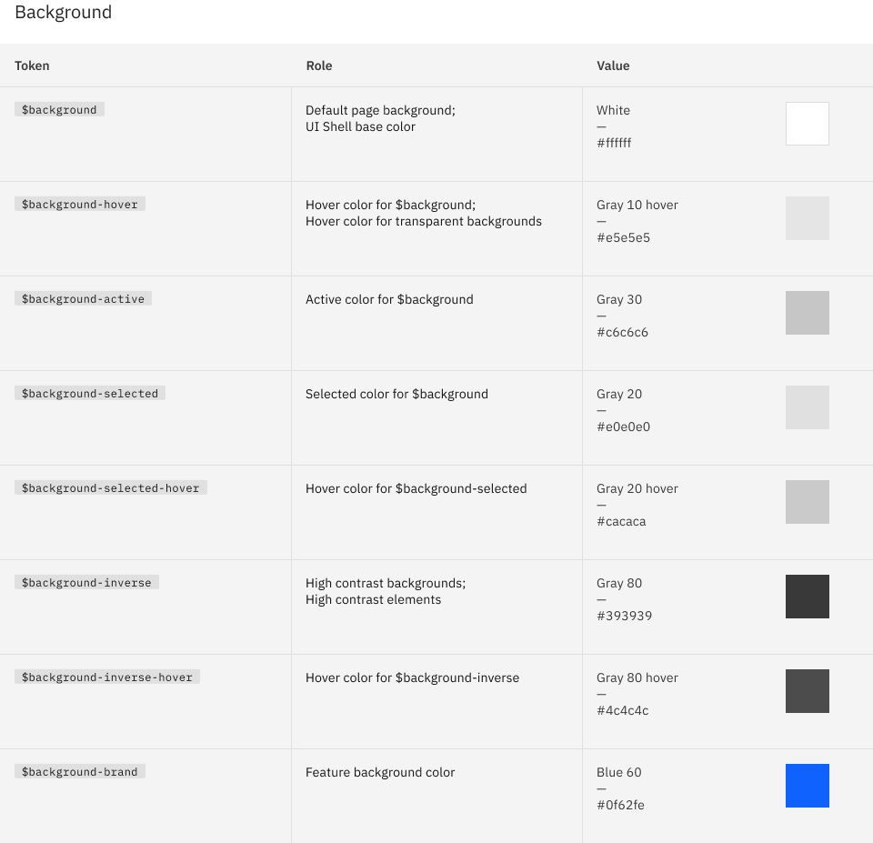

# Carbon Card Evidence

This file records the source evidence and schema decisions for the Carbon Card
mapping in `packages/presets/src/presets/carbon-ibm/components/card.schema.ts`.

## Sources

- Figma community file:
  [IBM Carbon Design System Community](https://www.figma.com/design/52HHpBaYAUdDKqAdH5vw8Y/IBM-Carbon-Design-System--Community-?node-id=2318-180868&t=qLbIokpcDKtcJ79I-4)
- Official color tokens:
  [Carbon color tokens](https://carbondesignsystem.com/elements/color/tokens/)

## Local Evidence

- Carbon community file background token reference:
  `packages/presets/docs/design-systems/carbon-ibm/evidence/card/figma-card-reference.png`

## Decisions

Carbon does not publish a formal Card component in the inspected community file.
The local evidence above is a Carbon background-token reference, not a Card
component reference. Kiskadee still needs real Card surfaces for component
showcase examples, so the Carbon preset defines a minimal Card component:

- square radius only;
- no Card shadow effect;
- neutral and primary intent buckets matching the shared Kiskadee Card surface
  contract;
- plain Carbon-like rectangular surfaces.

The light `neutral.medium` Card surface uses Carbon Gray 10 (`#F4F4F4`). It is
also the adjacent page surface used by the Switch showcase when the visible Card
surface is white (`neutral.low`).

The captured Figma background-token table also shows hover/selected background
tokens such as Gray 10 hover (`#E5E5E5`) and Gray 20 (`#E0E0E0`). Those are
interaction or selected background tokens, not the base `neutral.medium` Card
surface.
