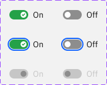
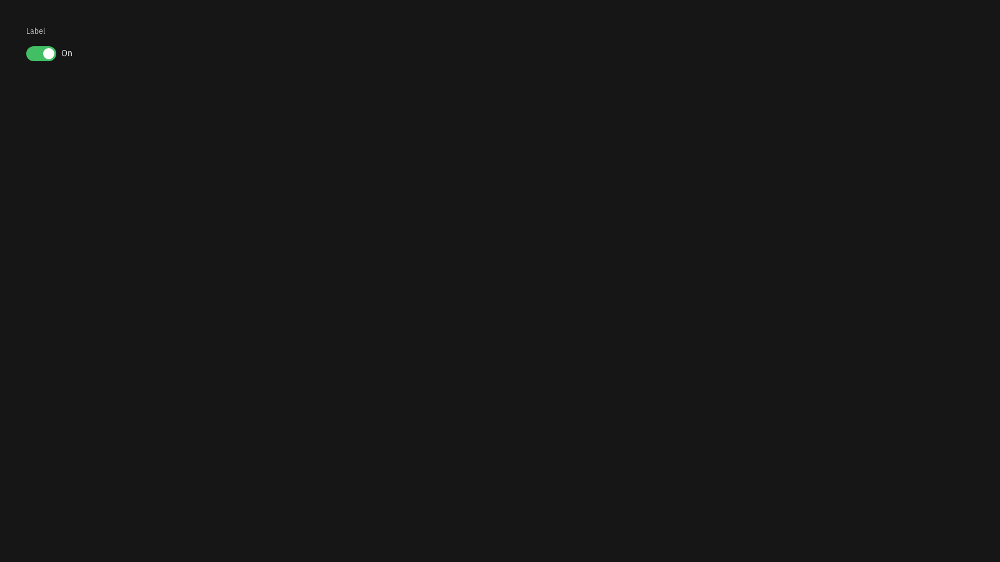

# Carbon Switch Evidence

This file records the source evidence and schema decisions for the Carbon Switch
mapping in `packages/presets/src/presets/carbon-ibm/components/switch.schema.ts`.

## Sources

- Figma small Switch reference:
  [IBM Carbon Design System Community, node 2599:187956](https://www.figma.com/design/52HHpBaYAUdDKqAdH5vw8Y/IBM-Carbon-Design-System--Community-?node-id=2599-187956&t=qLbIokpcDKtcJ79I-4)
- Official Toggle documentation:
  [Carbon Toggle usage](https://carbondesignsystem.com/components/toggle/usage/)
- Official React Storybook iframe inspected for Gray 100:
  [components-toggle--default, theme g100](https://react.carbondesignsystem.com/iframe.html?id=components-toggle--default&viewMode=story&globals=theme:g100)

## Local Evidence

- Figma small Switch node:
  `packages/presets/docs/design-systems/carbon-ibm/evidence/switch/figma-small-switch.png`
- Official site Gray 100 Toggle:
  `packages/presets/docs/design-systems/carbon-ibm/evidence/switch/carbon-toggle-gray-100.png`

## Figma-Derived Decisions

The Figma small Switch reference defines the compact Carbon size used by
Kiskadee as `s:sm:1`:

- track: `32 x 16`
- track radius: pill radius `8`
- thumb: `10 x 10`
- thumb radius: pill radius `5`
- thumb inset: `3`
- selected track: `#24A148`
- unselected track: `#8D8D8D`
- disabled track: `#C6C6C6`
- light text: `#161616`
- disabled text: `#C6C6C6`
- focus color: `#0F62FE`

## Site-Derived Decisions

The official Toggle docs expose a Gray 100 theme that was not available in the
inspected Figma node. The inspected Gray 100 treatment uses:

- background: `#161616`
- value/control text: `#F4F4F4`
- label text: `#C6C6C6`
- selected track: `#42BE65`
- default large Toggle track: `48 x 24` with pill radius `12`

Kiskadee registers this dark-surface treatment in two equivalent places:

- `default.light`: `switch.neutral.low`
- `default.dark`: `switch.neutral.medium`

This is a preset-authored palette equivalence for Carbon, not a generic
automatic inversion rule.
