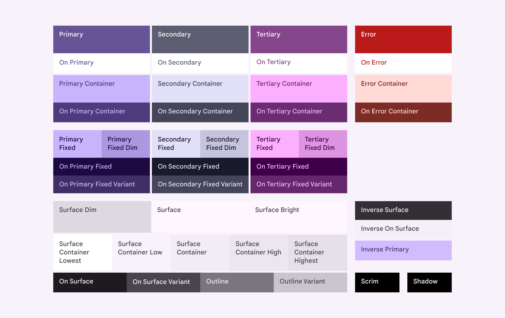
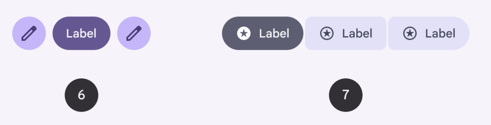
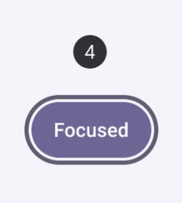
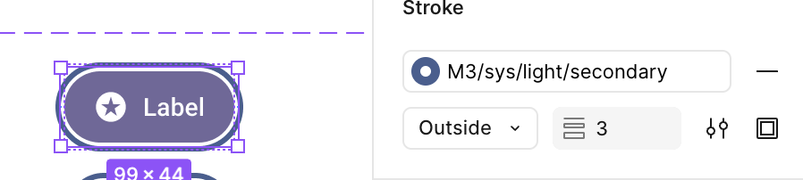
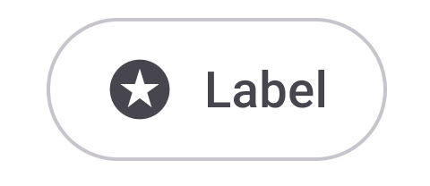
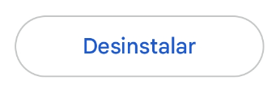
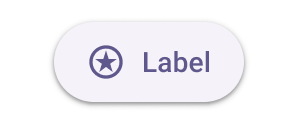
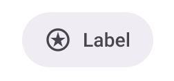

# Material Design 3 Google Source Evidence

This file records source evidence and preset-level decisions for
`packages/presets/src/presets/material-3-google/`.

## Reference Note

The image used as a reference for the Material color roles was downloaded from:
https://m3.material.io/styles/color/roles

The colors used in this preset are based on that reference.

Date: 2026-01-19

Local reference image:
- File: `packages/presets/docs/design-systems/material-design-3-google/evidence/source/material-color-roles.png`
- Preview: 

Figma reference:
- File: https://www.figma.com/community/file/1035203688168086460
- Name: Material 3 Design Kit
- Version: 1.23
- Last updated: 2025-08-12

Official typography reference:
- [Material 3 type scale tokens](https://m3.material.io/styles/typography/type-scale-tokens)

## Typography Evidence

The preset publishes a reusable type catalog and component elements select its profiles by
Kiskadee scale. Source-aligned profiles include Material's `label-medium`, `label-large`,
`body-small`, `body-medium`, and `body-large` metrics.

Button-only recipes are normalized as `label-extra-large`, `label-display-small`, and
`label-display-large`. They remain **Kiskadee adaptations** of the existing 16/24, 24/32, and
32/40 weight-500 output rather than claims that Material publishes those normalized labels.

Tabs now reuse `label-medium` and `label-large`; Bridge Tabs reuse `label-extra-large`. TextField
messages and floating labels reuse `body-small`. The former Tabs-only, compact supporting-text,
and floating-label recipes were removed: a component does not receive a distinct global
typography profile solely to preserve local geometry. Component alignment, padding, and height
remain local to the component schema.

This is a minimal normalization. A complete review of the current Material type ramp and its
tracking values is **Deferred**.

## Component Evidence

- [Switch](components/switch.md)

## Interface Icon Evidence

Primary source:
[Material Symbols guide](https://developers.google.com/fonts/docs/material_symbols).

Google identifies Material Symbols as the current Material icon family and exposes Outlined,
Rounded, and Sharp styles with variable fill, weight, grade, and optical-size axes. Kiskadee
recommends family `material-symbols` with variant `fill-0` for this preset: Outlined, Fill `0`,
Weight `400`, Grade `0`, and Optical Size `24`.

This is **Official adapted**: the upstream family and axis values are official, while Kiskadee
maps its canonical semantic names to Material ligatures and loads an alphabetically subsetted
Google Fonts variable stylesheet covering the supported Fill 0–1 axis only when this family is
selected. The `fill-1` variant is available to applications but is not the preset recommendation.
No icon-font URL or loader is stored in the preset schema.

## Inconsistencies

This section documents mismatches observed between different official Material channels. These notes exist to explain why a Kiskadee preset may need to pick a single reference source.

### Primary color (site vs. Figma UI Kit vs. Figma plugin)

Different official Material channels can surface different “default” purple values:

- The Material website reference image suggests `#65558e`.
- The Material 3 Figma UI Kit uses `#6750A4`.
- The Material 3 Figma color plugin may suggest `#673AB7` as a default.

Because the website reference is a static image, it may lag behind token updates. The plugin is also intentionally flexible and can generate many different schemes, so its default does not necessarily represent the canonical Material source color.

Decision: for Kiskadee, we treat the Figma UI Kit as the primary practical reference for the default Material 3 purple and therefore use `#6750A4`.

### Color scale (site vs. Figma)

The Material website visuals suggest a stronger differentiation between `primary` and `secondary` in the light tones than what we observe in the Material 3 Figma.

Image 1 (Material website):

In the Figma ecosystem, `primary` and `secondary` are very close in the light tones, and the differentiation becomes more noticeable in the darker tones.

Image 2 (Figma):

### Focus and interaction overlays (site vs. Figma)

On the Material documentation site, the UI preview shows a visible focus ring / outline in some examples, but the page does not clearly document which token/source color drives that ring:

In the Material 3 Figma ecosystem, the focus border is present but needs to be enabled in the component settings:

Decision: for Kiskadee, we follow the Material website as the reference for focus indication. By design, all focusable elements (including buttons) must render a visible border/outline in the `focus` state. We keep the border at **2px** (not 3px) for visual balance; the 3px option in Figma reads too heavy in real products. In practice, Google surfaces like Google Search, Gmail, Google Drive, and Google Maps do not use a 3px focus border.

#### Hover and focus overlays

Some Material samples implement hover/focus as a white overlay (e.g., 8% for hover, 10% for focus) applied on top of the base color. While that is a valid visual technique, it is not a portable, cross-platform-friendly rule for native and web implementations.

Decision: in Kiskadee, hover is expressed as a tone shift within the same palette (e.g., if `rest` is tone 60, `hover` becomes tone 55). For Material, the `focus` state keeps the same tone as `rest` and relies on the focus ring/outline for emphasis. This keeps a consistent rule across platforms without relying on opacity overlays.

#### Pressed feedback vs. pressed color

Material’s pressed feedback often relies on an activation animation. That is an effect, not the base pressed color.

Decision: Kiskadee treats activation feedback as an effect layer. The `pressed` state in the schema remains a tone-based color change, independent of the activation-feedback animation.

Decision: for pressed, Kiskadee uses a 10-step darker shift on the tonal scale. This larger contrast is intentional for touch devices: the user’s finger partially covers the UI feedback, so a stronger delta improves perceived confirmation. This 10-step shift is the default across all Kiskadee presets, but it is not a hard constraint—designers can increase or reduce the contrast as needed. We emphasize strong micro-interaction feedback while keeping the system flexible.

#### Color fidelity disclaimer (Figma vs. Kiskadee rounding)

In some comparisons, the base tone matches exactly between Figma and Kiskadee, but the alpha-composited result can differ by 1 RGB unit. Example: `#1C1B20` at 38% opacity over white yields `#E8E8E8` in Kiskadee and `#E9E9E9` in Figma (232 vs 233). This appears to be a rounding difference in the conversion pipeline (HSL/HCT/ARGB to HEX + alpha) rather than a real color mismatch. Figma shows `HSL(252, 8, 12)`, while Kiskadee uses `HSL(252, 8.47, 11.57)` before conversion, which is visually indistinguishable but can round differently after compositing.

Decision: Kiskadee treats 1-point RGB deltas caused by rounding as acceptable. Visual fidelity is maintained even when numeric values differ slightly across tools.

### Outlined button color (Play Store vs. Figma)

In the Material 3 Figma kit, the **outlined button** is shown with a neutral variant outline and neutral variant text (both in gray/near-black tones):

However, real-world usage (e.g., Google Play Store) shows an outlined button where the **text uses the primary color** (blue), indicating a **primary outlined** treatment not documented in the Figma kit or on the Material site:

Decision (Kiskadee adaptation):

- Support **two outlined treatments** in the preset:
  - **Neutral outlined**: neutral variant outline + neutral variant text (as in Figma).
  - **Primary outlined**: neutral variant outline + primary text (as seen in Play Store).
- This preserves fidelity with the Figma reference while acknowledging a real, production-grade variant used by Google.

## Adaptations

This section documents intentional adaptations needed to fit Material concepts into Kiskadee's fixed 16-position model (`subtle` + `vivid`).

### Secondary subtle handling (shared `subtle`, differentiated `vivid`)

Material defines tonal palettes for both `primary` and `secondary`. When mapping those palettes into Kiskadee's fixed 16-position model, we consistently observe that:

- The lightest tones (Kiskadee `subtle`) are extremely close between `primary` and `secondary`.
- The most noticeable differentiation happens in the darker tones (Kiskadee `vivid`), where hue/chroma identity becomes clearer.

Because of that, this preset keeps a single `subtle` ramp (shared baseline) and focuses `secondary` differentiation on the `vivid` track.

Image 1 (Figma):

In practice, the screenshot above is used as the main visual justification: in the light tones (Kiskadee `subtle`), `primary` and `secondary` are extremely close, while the differentiation becomes more noticeable in the darker tones (Kiskadee `vivid`).

### Primary, secondary, and tertiary colors

Material typically exposes four key color roles: `primary`, `secondary`, `tertiary`, and `error`.

In Kiskadee, the Material `error` role maps more naturally to `redLike` (Layer 2). This is intentional: “red” usage in real products is not exclusive to error states and often appears in other contexts such as form validation, destructive actions (delete/cancel), negative numbers, and attention/urgency patterns.

Kiskadee has a global `primary` semantic (Layer 2), which aligns directly with Material `primary`. However, Kiskadee does not expose global `secondary` or `tertiary` semantics as first-class keys. While many design systems label multiple brand colors as primary/secondary/tertiary, in UI practice these roles are frequently used as “escape” colors, accent variations, or contrast helpers without a consistent semantic contract across components.

In practice, Material `secondary` often behaves closer to Kiskadee `neutral` in the sense of emphasis hierarchy: it is usually less vibrant than `primary` and is commonly used as a lower-emphasis alternative to the main brand color. Note: Kiskadee `neutral` is typically associated with grayscale in many systems, but it can also represent a more subdued, low-chroma family depending on the preset.

Material `tertiary` is often used as a highlight/accent color with higher contrast and more open-ended intent. In Kiskadee, a comparable “accent” slot commonly lives under `purpleLike` (Layer 2), but Material `tertiary` may also be consumed directly as a `primitive color` (Layer 1) when a component needs an explicit, non-semantic accent chosen by the designer.

### Background colors (Neutral / Neutral Variant)

Material defines `neutral` (commonly used for backgrounds and surfaces) and `neutralVariant` (commonly used for mid-emphasis UI and variants).

In the Material 3 Figma ecosystem, the color plugin can generate these background-related ramps derived from the primary source color. In practice, for Kiskadee presets we prefer a simpler, more predictable approach:

- Use a pure grayscale ramp for backgrounds/surfaces.
- When a tinted surface is desired, use a lighter `primary` tone (Kiskadee `subtle`) explicitly, rather than deriving the entire neutral ramp from `primary`.

Decision: in all Material segments, Kiskadee uses a pure grayscale tonal scale for backgrounds, with no dependency on the primary color.

### Material CorePalette mapping into Kiskadee layers

Material's `CorePalette` exposes six tonal ramps: `a1`, `a2`, `a3`, `n1`, `n2`, and `error`.
Kiskadee maps these ramps into its 3-layer model as follows:

- `a1` -> Layer 1 primitive: `primary` hue `v1` (global semantic `primary`)
- `a2` -> Layer 1 primitive: same hue `v2` (global semantic `neutral`)
- `a3` -> Layer 1 primitive: accent hue `v1` (kept as a primitive; not bound to a global semantic by default)
- `n1` -> Layer 1 primitive: `black.v1` (background/surface ramp)
- `n2` -> Layer 1 primitive: `black.v2` (neutral variant ramp)
- `error` -> Layer 1 primitive: `red.v1` (global semantic `redLike`)

Notes:
- The `a2` ramp (Material "secondary") is used as a low-emphasis neutral family in Kiskadee.
- The `a3` ramp (Material "tertiary") is stored for optional direct use in components but is not automatically mapped to a semantic slot.
- The neutral ramps (`n1`, `n2`) remain grayscale in Kiskadee for predictability across segments.

### Toggle button vs. Toggle button elevated

Material 3 defines two variants in Figma:

- **Toggle button** (no shadow)
- **Toggle button elevated** (with shadow)

In Kiskadee, shadow is an **effect** that is opt-in and does not change text or background colors.
We intentionally keep it that way; adding shadow should not alter the base palette.

Observations from the Material kit:

- Both toggle variants are based on **Material neutral** (equivalent to Kiskadee `neutral.v1`), not the primary ramp.
  The neutral ramp has a slight hue bias toward the primary color but remains a neutral family.
- The two variants differ mainly by **surface tone** (one is lighter than the other).
- The elevated variant uses **primary-colored text**, while the non-elevated uses **black text**.

Decision (Kiskadee adaptation):

- We do **not** model two separate toggle button variants.
- We keep a **single toggle button** style based on the **lighter surface tone** (matching the elevated variant).
- Text uses the **primary** color.
- Shadow remains an opt-in **effect**, so any toggle button can be elevated if needed.

This preserves semantic consistency and avoids duplicating intents for a pattern that is rarely used in real products.

Image references:

Toggle button elevated (with shadow):

Toggle button (no shadow):

### Switch component geometry

The durable Switch extraction from the Material 3 Design Kit Community is documented in:

- [Switch evidence](components/switch.md)

Summary:

| Part | Size |
| --- | ---: |
| Track | `52 x 32` |
| Unselected/default handle shape | `16 x 16` |
| Selected/default handle shape | `24 x 24` |
| State layer | `40 x 40` |
| Pressed handle shape | `28 x 28` |
| Target | `48 x 48` |
| Focus indicator | `56 x 36`, `3px` stroke |

The inspected component set does not expose multiple Switch sizes. Kiskadee therefore keeps only
`s:md:1` for Material 3 Google Switch.

Kiskadee adaptation:

- The schema uses the canonical track size `52 x 32`.
- The schema uses a stable `24 x 24` thumb carrier plus the `thumbShrink` effect for the unselected
  `16 x 16` visual handle.
- The V0 `activationFeedback` halo uses an `8px` shadow around the stable thumb carrier to reach
  the Figma `40 x 40` state-layer size.
- Material's `28 x 28` pressed handle and optional on/off icons are reference-only for now.
- Selected/on track colors stay in `selected.<interaction>` and use references, because selected
  state is owned by the Switch root and track/thumb are child slots.
