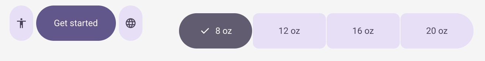
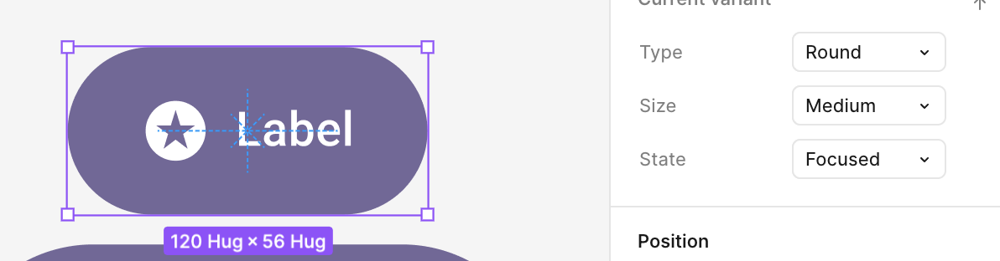

### Reference note (Material Design 3)

The image used as a reference for the Material color roles was downloaded from:
https://m3.material.io/styles/color/roles

The colors used in this preset are based on that reference.

Date: 2026-01-19

Local reference image:
- File: `color.png`
- Preview: 

### 2. Inconsistencies

This section documents mismatches observed between different official Material channels. These notes exist to explain why a Kiskadee preset may need to pick a single reference source.

#### 2.1. Primary color (site vs. Figma UI Kit vs. Figma plugin)

Different official Material channels can surface different “default” purple values:

- The Material website reference image suggests `#65558e`.
- The Material 3 Figma UI Kit uses `#6750A4`.
- The Material 3 Figma color plugin may suggest `#673AB7` as a default.

Because the website reference is a static image, it may lag behind token updates. The plugin is also intentionally flexible and can generate many different schemes, so its default does not necessarily represent the canonical Material source color.

Decision: for Kiskadee, we treat the Figma UI Kit as the primary practical reference for the default Material 3 purple and therefore use `#6750A4`.

#### 2.2. Color scale (site vs. Figma)

The Material website visuals suggest a stronger differentiation between `primary` and `secondary` in the light tones than what we observe in the Material 3 Figma.

Image 1 (Material website):

In the Figma ecosystem, `primary` and `secondary` are very close in the light tones, and the differentiation becomes more noticeable in the darker tones.

Image 2 (Figma):

#### 2.3. Focus and interaction overlays (site vs. Figma)

On the Material documentation site, the UI preview shows a visible focus ring / outline in some examples, but the page does not clearly document which token/source color drives that ring:

In the Material 3 Figma ecosystem (UI kit + plugin outputs), this focus indication may not be represented in the same way (or may be omitted entirely in the assets we referenced):

Decision: for Kiskadee, we follow the Material website as the reference for focus indication. By design, all focusable elements (including buttons) must render a visible border/outline in the `focus` state. Differences in the Figma ecosystem (especially in mobile-first assets) should not be interpreted as “no focus border”.

##### 2.3.1. Hover and focus overlays

Some Material samples implement hover/focus as a white overlay (e.g., 8% for hover, 10% for focus) applied on top of the base color. While that is a valid visual technique, it is not a portable, cross-platform-friendly rule for native and web implementations.

Decision: in Kiskadee, hover is expressed as a tone shift within the same palette (e.g., if `rest` is tone 60, `hover` becomes tone 55). For Material, the `focus` state keeps the same tone as `rest` and relies on the focus ring/outline for emphasis. This keeps a consistent rule across platforms without relying on opacity overlays.

##### 2.3.2. Pressed ripple vs. pressed color

Material’s pressed feedback often relies on the ripple animation. That is an effect, not the base pressed color.

Decision: Kiskadee treats the ripple as a future effect layer. The `pressed` state in the schema remains a tone-based color change, independent of the ripple animation.

Decision: for pressed, Kiskadee uses a 10-step darker shift on the tonal scale. This larger contrast is intentional for touch devices: the user’s finger partially covers the UI feedback, so a stronger delta improves perceived confirmation. This 10-step shift is the default across all Kiskadee presets, but it is not a hard constraint—designers can increase or reduce the contrast as needed. We emphasize strong micro-interaction feedback while keeping the system flexible.

### 3. Adaptations

This section documents intentional adaptations needed to fit Material concepts into Kiskadee's fixed 16-position model (`subtle` + `vivid`).

#### 3.1. Secondary subtle handling (shared `subtle`, differentiated `vivid`)

Material defines tonal palettes for both `primary` and `secondary`. When mapping those palettes into Kiskadee's fixed 16-position model, we consistently observe that:

- The lightest tones (Kiskadee `subtle`) are extremely close between `primary` and `secondary`.
- The most noticeable differentiation happens in the darker tones (Kiskadee `vivid`), where hue/chroma identity becomes clearer.

Because of that, this preset keeps a single `subtle` ramp (shared baseline) and focuses `secondary` differentiation on the `vivid` track.

Image 1 (Figma):

In practice, the screenshot above is used as the main visual justification: in the light tones (Kiskadee `subtle`), `primary` and `secondary` are extremely close, while the differentiation becomes more noticeable in the darker tones (Kiskadee `vivid`).

#### 3.2. Primary, secondary, and tertiary colors

Material typically exposes four key color roles: `primary`, `secondary`, `tertiary`, and `error`.

In Kiskadee, the Material `error` role maps more naturally to `redLike` (Layer 2). This is intentional: “red” usage in real products is not exclusive to error states and often appears in other contexts such as form validation, destructive actions (delete/cancel), negative numbers, and attention/urgency patterns.

Kiskadee has a global `primary` semantic (Layer 2), which aligns directly with Material `primary`. However, Kiskadee does not expose global `secondary` or `tertiary` semantics as first-class keys. While many design systems label multiple brand colors as primary/secondary/tertiary, in UI practice these roles are frequently used as “escape” colors, accent variations, or contrast helpers without a consistent semantic contract across components.

In practice, Material `secondary` often behaves closer to Kiskadee `neutral` in the sense of emphasis hierarchy: it is usually less vibrant than `primary` and is commonly used as a lower-emphasis alternative to the main brand color. Note: Kiskadee `neutral` is typically associated with grayscale in many systems, but it can also represent a more subdued, low-chroma family depending on the preset.

Material `tertiary` is often used as a highlight/accent color with higher contrast and more open-ended intent. In Kiskadee, a comparable “accent” slot commonly lives under `purpleLike` (Layer 2), but Material `tertiary` may also be consumed directly as a `primitive color` (Layer 1) when a component needs an explicit, non-semantic accent chosen by the designer.

#### 3.3. Background colors (Neutral / Neutral Variant)

Material defines `neutral` (commonly used for backgrounds and surfaces) and `neutralVariant` (commonly used for mid-emphasis UI and variants).

In the Material 3 Figma ecosystem, the color plugin can generate these background-related ramps derived from the primary source color. In practice, for Kiskadee presets we prefer a simpler, more predictable approach:

- Use a pure grayscale ramp for backgrounds/surfaces.
- When a tinted surface is desired, use a lighter `primary` tone (Kiskadee `subtle`) explicitly, rather than deriving the entire neutral ramp from `primary`.

Decision: in all Material segments, Kiskadee uses a pure grayscale tonal scale for backgrounds, with no dependency on the primary color.

#### 3.4. Material CorePalette mapping into Kiskadee layers

Material's `CorePalette` exposes six tonal ramps: `a1`, `a2`, `a3`, `n1`, `n2`, and `error`.
Kiskadee maps these ramps into its 3-layer model as follows:

- `a1` -> Layer 1 primitive: `primary` hue `v1` (global semantic `primary`)
- `a2` -> Layer 1 primitive: same hue `v2` (global semantic `neutral`)
- `a3` -> Layer 1 primitive: accent hue `v1` (kept as a primitive; not bound to a global semantic by default)
- `n1` -> Layer 1 primitive: `black.v1` (background/surface ramp)
- `n2` -> Layer 1 primitive: `black.v2` (neutral variant ramp)
- `error` -> Layer 1 primitive: `red.v1` (global semantic `redLike`)

Notes:
- The `a2` ramp (Material "secondary") is used as a low-emphasis neutral family in Kiskadee.
- The `a3` ramp (Material "tertiary") is stored for optional direct use in components but is not automatically mapped to a semantic slot.
- The neutral ramps (`n1`, `n2`) remain grayscale in Kiskadee for predictability across segments.
