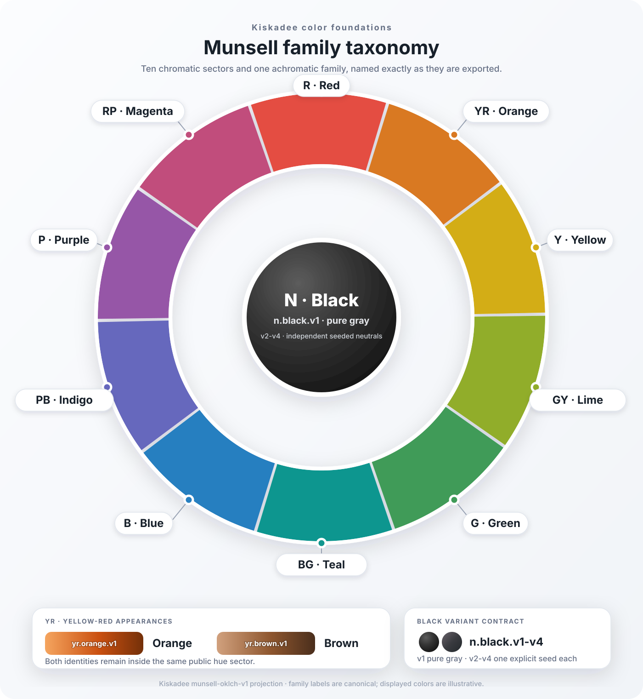

# Kiskadee Munsell Family Taxonomy v1

Status: canonical package-level definition.

Kiskadee uses the ten complete Munsell hue-family names as the stable Layer 1
color taxonomy. The implementation is a Kiskadee projection into OKLCH; it is
not a general-purpose converter for Munsell notation or physical color chips.

## Public Families

The chromatic sectors are ordered around the hue circle as follows:

```txt
red
yellow-red
yellow
green-yellow
green
blue-green
blue
purple-blue
purple
red-purple
```

`black` is the separate achromatic family. It contains the Design System's
authored gray trajectory and may be subtly tinted, but it is never a chromatic
harmony reference. `neutral` is not a Layer 1 family name.

Every primary-derived system contains these family ids:

```txt
red.v1
yellow-red.v1
yellow-red.v2
yellow.v1
green-yellow.v1
green.v1
blue-green.v1
blue.v1
purple-blue.v1
purple.v1
red-purple.v1
black.v1
```

`v1` is the base appearance of each chromatic sector. `yellow-red.v1` is the
Orange appearance and `yellow-red.v2` is permanently reserved for Brown.
Other `v2` through `v4` ids are authored variants and require explicit seeds.

## OKLCH Projection

The `munsell-oklch-v1` projection freezes these hue centers:

| Sector | OKLCH hue |
| --- | ---: |
| red | 30deg |
| yellow-red | 65deg |
| yellow | 103deg |
| green-yellow | 116deg |
| green | 145deg |
| blue-green | 198deg |
| blue | 250deg |
| purple-blue | 272deg |
| purple | 322deg |
| red-purple | 351deg |

Sector boundaries are the circular midpoints between adjacent centers. An
interval includes its start and excludes its end, including the wrap between
red-purple and red. This removes ambiguous equality at a boundary.

The inner 15% through 85% of each interval is its safe generation region.
Authored colors in the outer bands remain valid but require review. Derived
colors are projected to the same relative location in every target sector and
clamped to the safe region when necessary. Generation also keeps a small
deterministic inset from the 15% and 85% edges so sRGB quantization cannot push
an emitted seed back outside the safe region. Classification or clamping is
always reported; it is never hidden.

A chromatic primary with OKL chroma below `0.005` fails because its hue is not
reliable. Chroma from `0.005` through `0.02` is classifiable but requires review.

## Primary And Variants

The primary sector is classified automatically from the normalized primary
hex. Automatic variant selection normally resolves to `v1`. Within yellow-red,
the seed is compared perceptually with the frozen Orange `#ca5010` and Brown
`#8e562e` prototypes; the closer appearance proposes `v1` or `v2`. Authors may
correct the variant without changing the classified sector. Export locks the
resolved family id.

The prototypes are perceptual comparison references, not exceptions to the
frozen sector boundaries. Sector classification always runs first. In
particular, `#ca5010` lies on the red side of the fixed red/yellow-red midpoint
in this projection, so it cannot bypass that classification merely because it
is the Orange comparison prototype.

Brown uses the yellow-red hue projection and the same shared Light and Dark
rest positions as every other family. Its target gamut utilization is initially
`0.6` of the Orange appearance. Functional harmony still outranks keeping the
rest color visibly dark, so a very light rest may appear tan while physically
darker positions retain the Brown character.

`black.v1` defaults to `#20252b` and is not derived from the primary. Authored
black seeds above OKL chroma `0.04` require review; values above `0.08` fail.

## Identity Invariants

- A chromatic family seed must classify inside its declared sector.
- Generated hues must stay in the safe region of the destination sector.
- Hue fitting cannot be used to satisfy harmony; lightness and relative chroma
  are the adjustable dimensions.
- Brown remains yellow-red and cannot be replaced by an Orange-like v2 seed.
- The same recipe, contracts, and generator version must emit identical bytes.


